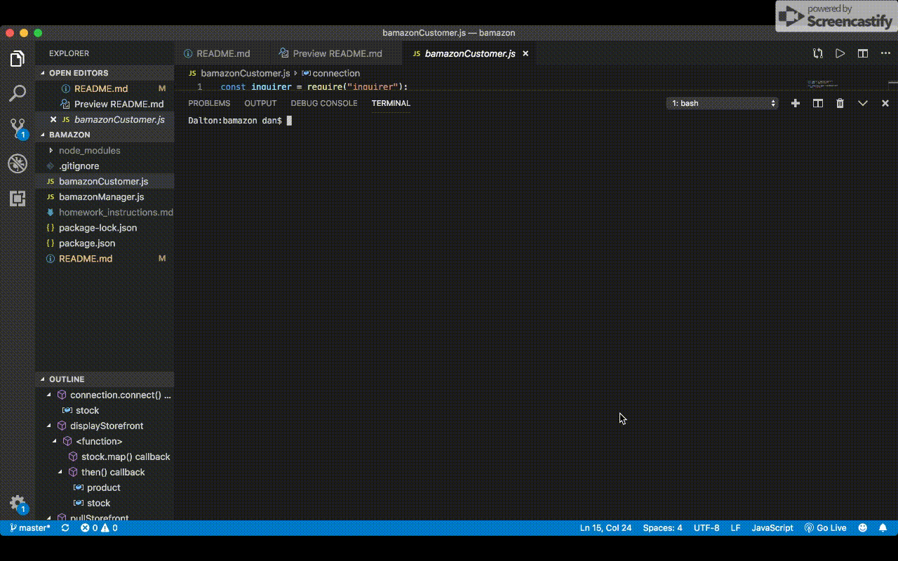

# Bamazon

## Overview
This application is a CLI for accessing a fictitious Amazon storefront to purchase and manage items.

## Set Up
In order to use this application, you will need to run:

```
npm install
```

in your terminal window for this folder.

This application is also built to assume you have a SQL database called bamazon stored locally, so you will need to create that and edit these lines in bamazonCustomer.js and bamazonManager.js to your connection's info:

```javascript
const connection = mysql.createConnection({
    host: "localhost",

    // Your port; if not 3306
    port: 3306,

    // Your username
    user: "",

    // Your password
    password: "",
    database: "bamazon"
});
```

In your SQL database, you will also have to run this query to create the products table

```sql
CREATE TABLE `products` (
  `item_id` int(11) NOT NULL AUTO_INCREMENT,
  `product_name` varchar(100) NOT NULL,
  `department_name` varchar(100) NOT NULL,
  `price` double NOT NULL,
  `stock_quantity` int(11) DEFAULT '1',
  PRIMARY KEY (`item_id`)
);
```

## Using the Application

### As A Customer

As a customer you have the ability to purchase one or more items from the database, when you do this the stock of that item decreases by 1. The prompt does not display items with a stock of zero.

To use, run in your terminal window this command:

```
node bamazonCustomer.js
```



### As A Manager

As a manager you have more options. The first "View Products For Sale" is to simply return a table of all of your products with some information about each.

The second "View Low Inventory" returns any products with a stock quantity that is less than 5.

The third "Add to Inventory" allows you to increase the stock of an item using its product id.

The last "Add New Product" allows you to add a new product to your inventory.

To use, run in your terminal window this command:

```
node bamazonManager.js
```

